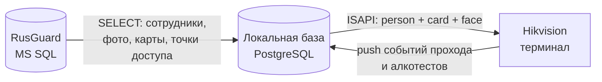

# ZKBio — синхронизация СКУД

Laravel 13 / PHP 8.4. Забирает сотрудников из **RusGuard** и раскладывает их по физическим
терминалам **Hikvision** (напрямую по ISAPI). Плюс кастомная надстройка: контроль
алкотестирования на проходной.

RusGuard — источник правды. Приложение ничего не решает само: оно приводит состояние
терминалов к тому, что сейчас записано в RusGuard, и делает это непрерывно.

---

## 1. Как устроен поток данных



Два независимых направления:

**Вниз (RusGuard → терминалы)** — раз в час полная сверка плюс реакция на изменения в течение
минуты. Что уезжает на терминал: сам человек, его карты, его фото (лицо) и флаг «пропустить
алкотест».

**Вверх (терминалы → мы)** — терминал сам присылает события прохода и результаты алкотестов на
наш вебхук в реальном времени. Если push отвалился, есть подстраховка опросом раз в 30 минут.

### Что происходит по шагам

1. **`rusguard:poll-audit`** раз в минуту читает журнал аудита RusGuard. Увидел изменение по
   доступам или группам алкотестирования — ставит в очередь пересинк.
2. **`SyncAllJob`** читает RusGuard целиком и обновляет локальную базу: точки доступа,
   сотрудников, их карты и фото, привязку «кто к какой точке имеет доступ». Люди и точки,
   пропавшие из RusGuard, деактивируются, а не удаляются.
3. **`SyncHikvisionTerminalJob`** приводит терминал в соответствие с локальной базой: заводит
   отсутствующих, дописывает карты, заливает лица, снимает тех, кого больше нет в списке.
4. Терминал **пушит** каждое событие к нам на вебхук; события с показанием алкотестера
   сохраняются в `access_events`.

Ключевая идея всей связки: **синк идемпотентен**. Он каждый раз сравнивает состояние и пишет
только разницу, поэтому его безопасно запускать хоть каждую минуту, и любой пропущенный запуск
догоняется следующим.

---

## 2. Из чего состоит

### Контейнеры

| Контейнер | Что делает |
|---|---|
| `zkbio_nginx` | Веб-морда, хост `8000` → контейнерный `80` |
| `zkbio_app` | php-fpm, обслуживает веб-запросы и вебхуки терминалов |
| `zkbio_queue` | `queue:work` — вся тяжёлая работа (синки) идёт здесь |
| `zkbio_scheduler` | `schedule:work` — таймеры |
| `zkbio_postgres` | Локальная база, хост `5433` → `5432` |

RusGuard живёт снаружи и в docker-compose не входит — к его MS SQL мы просто подключаемся.

### Сервисы

| Класс | Ответственность |
|---|---|
| `RusGuardDatabaseService` | Чтение из MS SQL RusGuard: сотрудники, фото, карты, точки, журнал аудита, группы алкотестирования |
| `SyncService` | RusGuard → локальная база |
| `HikvisionService` | Голый ISAPI: персоны, карты, лица, настройка вебхука, параметры алкотестера |
| `HikvisionSyncService` | Локальная база → конкретный терминал Hikvision |
| `HikvisionEventIngestService` | Приём и дедупликация событий с терминала |

`RusGuardService` / `EmployeeService` — SOAP-клиент к RusGuard. Рабочий, но в текущем потоке
данные берутся напрямую из MS SQL: быстрее и без ограничений WSDL.

### Основные таблицы

- `employees` — сотрудники, `emp_code` это их номер на терминалах, `rusguard_uuid` — связь с RusGuard
- `employee_keys` — карты (у человека их может быть несколько)
- `access_points` — точки доступа, модель `AccessPoint`
- `hikvision_terminals` — терминалы, `sync_stats` хранит итог последнего синка, `last_push_at` — когда терминал последний раз выходил на связь
- `access_events` — события с алкотестом
- `sync_logs` — построчный журнал действий синка (хранится 30 дней)
- `sync_runs` — по строке на каждый запуск синка: длительность, счётчики, чем запущен (хранится 90 дней)

### Расписание

| Когда | Что |
|---|---|
| раз в минуту | `rusguard:poll-audit` — реакция на изменения в RusGuard |
| раз в 5 минут | `alcohol:clear-expired-skip` — снятие истёкших послепроходных отсрочек |
| раз в 15 минут | `hikvision:sync-all` — раскладка по терминалам |
| раз в 30 минут | `hikvision:fetch-events --minutes=35` — подстраховка на случай, если push молчит |
| раз в час | `SyncAllJob` — полная сверка с RusGuard, гарантия сходимости |
| раз в сутки | чистка `sync_logs`, `sync_runs`, `failed_jobs` |

Часовая полная сверка — это «пол» корректности. Минутный поллер реагирует быстро, но умеет
распознавать только известные ему типы сообщений аудита; всё остальное подбирает часовой проход.

---

## 3. События в реальном времени

Терминал Hikvision настраивается как «слушающий хост» (`HttpHostNotification`) и сам шлёт
POST'ы на `/api/hikvision/{terminal}/events/{token}`. Аутентификации там нет — терминал не умеет
сессии Laravel, поэтому секретом служит сам токен в пути (`HIKVISION_WEBHOOK_TOKEN`).

Важные детали, на которых уже спотыкались:

- **Терминал должен уметь резолвить имя сервера.** Один раз push не работал сутки, потому что в
  сетевых настройках самого устройства был выключен DNS. Чинится только через веб-интерфейс
  терминала, снаружи по ISAPI это не правится.
- **Фильтр событий обязателен.** Без блока `<SubscribeEvent>` терминал шлёт всё подряд, включая
  открытия дверей и админские операции. Настроен `eventMode=list` с конкретными кодами.
- **Heartbeat раз в 30 секунд.** Это и есть сигнал «я жив» — по нему на странице мониторинга
  видно, что push работает, даже когда через турникет никто не ходит.
- Каждое событие имеет `serialNo` — по нему идёт дедупликация, поэтому повторная доставка
  (например, когда терминал вываливает накопленный за простой бэклог) ничего не дублирует.

Если push настроен заново или переехал адрес — `php artisan hikvision:configure-webhook`.

---

## 4. Алкотестирование

Кастомная надстройка. Кто обязан продуваться — определяется группами алкотестирования в RusGuard
и вычитывается свежим на каждом синке, локально этот список не кэшируется.

Логика: человек прошёл алкотест успешно → на терминал уезжает флаг «не спрашивать с него тест»
на N минут (`ALCOHOL_SKIP_GRACE_MINUTES`, настраивается на странице `/alcohol`). Истёк — флаг
снимается по расписанию. Провалил тест → уходит письмо на настроенные адреса.

Страница `/alcohol` показывает текущее состояние, `/alcohol/{employee}/debug` — инструмент для
разбора конкретного человека.

---

## 5. Мониторинг

`/monitoring` — одна страница, отвечающая на вопрос «всё ли работает».

- **Здоровье интеграций.** Когда терминал последний раз выходил на связь, когда последний раз
  опрашивался RusGuard. Молчание терминала больше 5 минут — красный индикатор. Это ловит отказ,
  который иначе не виден: 30-минутный опрос продолжает таскать события, и снаружи всё выглядит
  здоровым, пока push мёртв.
- **Очередь.** Что ждёт, что выполняется, что упало — с кнопками перезапуска.
- **Проблемы.** Люди без лица на терминале, с разделением причины: нет фото в RusGuard (чинится
  в RusGuard) или терминал отказался принять фото (чинится на терминале). Плюс люди без карты.
- **История прогонов.** Длительности и счётчики каждого синка — по ним видно, что синк начал
  тормозить или что счётчик поехал.

---

## 6. Развёртывание на сервере

### Что нужно от сервера

- Docker и Docker Compose
- Сетевой доступ к MS SQL RusGuard (по умолчанию порт 1433)
- Сетевой доступ к терминалам по их IP
- **И обратно: терминалы должны доставать до сервера по HTTPS.** Без этого не будет push'а
- Домен с валидным сертификатом. На самоподписанный терминал может молча не пойти

### Шаги

**1. Код и конфигурация**

```bash
git clone <repo> /opt/zkbio && cd /opt/zkbio
cp .env.example .env
```

Заполнить в `.env`:

```ini
APP_ENV=production
APP_DEBUG=false
APP_URL=https://zkbio.example.com

# Локальная база
DB_CONNECTION=pgsql
DB_HOST=postgres
DB_PORT=5432
DB_DATABASE=zkbio
DB_USERNAME=zkbio
DB_PASSWORD=<сменить и синхронизировать с docker-compose.yml>

# RusGuard (MS SQL), читаем напрямую
RUSGUARD_DB_HOST=<хост>
RUSGUARD_DB_DATABASE=<база>
RUSGUARD_DB_USERNAME=<логин>
RUSGUARD_DB_PASSWORD=<пароль>
RUSGUARD_EXCLUDED_GROUP_IDS=<UUID групп через запятую — обычно уволенные>

# RusGuard SOAP (не в основном потоке, но заполнить)
RUSGUARD_WSDL=
RUSGUARD_LOGIN=
RUSGUARD_PASSWORD=

# Вебхук терминалов — публичный адрес, до которого дотягивается терминал
HIKVISION_WEBHOOK_BASE_URL=https://zkbio.example.com
HIKVISION_WEBHOOK_TOKEN=<длинная случайная строка>

# Письма о проваленных алкотестах
MAIL_MAILER=smtp
MAIL_HOST=
MAIL_PORT=
MAIL_USERNAME=
MAIL_PASSWORD=
MAIL_FROM_ADDRESS=
```

Пароль постгреса задан в двух местах — в `.env` и в `docker-compose.yml`. Менять надо оба.

`RUSGUARD_DB_PORT` в конфиге есть, но в строку подключения не подставляется. Если порт
нестандартный — писать его прямо в хосте: `RUSGUARD_DB_HOST=10.0.0.5:1435`.

**2. Сборка и запуск**

```bash
docker compose build
docker compose run --rm app composer install --no-dev --optimize-autoloader
docker compose run --rm app php artisan key:generate
docker compose up -d
```

Composer ставится разово, до `up -d`: без каталога `vendor` контейнеры очереди и планировщика
будут падать и перезапускаться по кругу.

**3. База и фронтенд**

```bash
docker exec zkbio_app php artisan migrate --force
docker run --rm -v "$PWD":/app -w /app node:22-alpine sh -c "npm ci && npm run build"
```

Node в образе приложения нет — сборка идёт одноразовым контейнером, чтобы не ставить его на
сервер. Если node уже есть локально, достаточно `npm ci && npm run build`.

Без сборки страницы упадут с ошибкой про манифест Vite.

**4. Права на запись**

```bash
docker exec zkbio_app chown -R www-data:www-data storage bootstrap/cache
```

Фото сотрудников складываются в `storage/app/photos` — каталог должен быть доступен на запись,
и его стоит включить в бэкап (перезалить их из RusGuard можно, но это долго).

**5. Кэши**

```bash
docker exec zkbio_app php artisan config:cache
docker exec zkbio_app php artisan route:cache
docker exec zkbio_app php artisan view:cache
```

**6. Первый пользователь**

Регистрация открыта — завести аккаунт через веб-интерфейс и после этого закрыть регистрацию,
если снаружи доступен не только офис.

**7. Терминалы**

Завести терминалы в интерфейсе (`/hikvision`), привязать каждый к точке доступа, затем:

```bash
docker exec zkbio_app php artisan hikvision:configure-webhook
```

Эта команда прописывает в терминал адрес из `HIKVISION_WEBHOOK_BASE_URL`. **Её надо
перезапускать при каждой смене адреса** — иначе терминал продолжит стучаться на старый.

**8. Проверка**

```bash
# Вебхук доступен снаружи: должен ответить 405 (маршрут только POST), а не 502/404
curl -o /dev/null -w '%{http_code}\n' https://zkbio.example.com/api/hikvision/1/events/x

# Синк проходит
docker exec zkbio_app php artisan hikvision:sync-all
```

Дальше открыть `/monitoring`: в течение минуты терминал должен «выйти на связь», индикаторы
позеленеть, а в истории прогонов появиться запись с длительностью.

### Обновление

```bash
git pull
docker exec zkbio_app composer install --no-dev --optimize-autoloader
docker exec zkbio_app php artisan migrate --force
docker run --rm -v "$PWD":/app -w /app node:22-alpine sh -c "npm ci && npm run build"
docker exec zkbio_app php artisan config:cache && docker exec zkbio_app php artisan route:cache && docker exec zkbio_app php artisan view:cache
docker exec zkbio_queue php artisan queue:restart
docker restart zkbio_app
```

Два последних шага обязательны и по одной и той же причине: и воркер очереди, и php-fpm держат
код в памяти. Без перезапуска синк отработает старым кодом и отчитается об успехе — ошибки не
будет, будет неправильное поведение.

---

## 7. Эксплуатация

### Команды

```bash
php artisan hikvision:sync-all                 # разложить по всем терминалам
php artisan hikvision:fetch-events --minutes=60 # добрать события за период
php artisan hikvision:configure-webhook [id]   # прописать вебхук в терминал
php artisan rusguard:poll-audit                # разово проверить журнал RusGuard
php artisan alcohol:clear-expired-skip         # снять истёкшие отсрочки
```

### Если что-то не работает

**Терминал не пушит события** (красный индикатор на `/monitoring`) — по порядку: доступен ли
сервер снаружи (`curl` из п. 8 выше), жив ли сертификат, включён ли DNS на самом терминале,
не слетел ли у него конфиг вебхука. Последнее видно так:

```bash
# Спросить сам терминал, куда он сейчас шлёт события — там должен быть наш URL
curl -s --digest -u admin:<пароль> http://<ip-терминала>/ISAPI/Event/notification/httpHosts
```

Если URL на месте, а событий нет — проблема на нашей стороне сети, не на терминале.

Пока push молчит, события всё равно приходят, но с задержкой до 30 минут — не потеряются.

**Синк падает** — `/monitoring`, блок очереди: там текст ошибки и кнопка перезапуска. Терминал
недоступен по сети — самая частая причина.

**Человек не появляется на терминале** — `/monitoring`, блок проблем. Скорее всего либо нет фото
в RusGuard, либо терминал отказался его принять. Второе иногда лечится заменой фотографии;
повторно одно и то же фото система намеренно не долбит, пока оно не изменится. Кнопка
«попробовать заново» сбрасывает этот запрет.

**Логи**

```bash
docker logs zkbio_queue --tail 50      # что делали джобы и сколько это заняло
docker logs zkbio_scheduler --tail 50  # отработал ли планировщик
docker exec zkbio_app tail -f storage/logs/laravel.log
```

---

## 8. Разработка

Тесты гоняются в контейнере: у хостового PHP нет `pdo_sqlite` и нет доступа к сети докера.

```bash
docker exec zkbio_queue php artisan test --compact
docker exec zkbio_queue php artisan test --compact --filter=MonitoringHealthTest
vendor/bin/pint --dirty          # форматирование перед коммитом
```

При локальной разработке терминалу нужен публичный адрес — обычно это туннель:

```bash
ngrok http --url=<ваш-домен>.ngrok-free.dev 8000
```

Порт именно `8000` — это то, что опубликовано наружу, `80` живёт только внутри контейнера
nginx. Туннель — самое хрупкое звено в этой схеме: когда push «ломается» на локальной машине,
в девяти случаях из десяти виноват он, а не терминал. На сервере с настоящим доменом туннель
не нужен.
